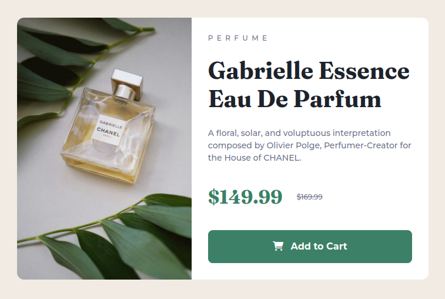

# Frontend Mentor - Product preview card component solution

This is a solution to the [Product preview card component challenge on Frontend Mentor](https://www.frontendmentor.io/challenges/product-preview-card-component-GO7UmttRfa). Frontend Mentor challenges help you improve your coding skills by building realistic projects.

## Table of contents

- [Overview](#overview)
  - [The challenge](#the-challenge)
  - [Screenshot](#screenshot)
  - [Links](#links)
- [My process](#my-process)
  - [Built with](#built-with)
  - [What I learned](#what-i-learned)
  - [Continued development](#continued-development)
  - [Useful resources](#useful-resources)
- [Author](#author)

## Overview

### The challenge

Users should be able to:

- View the optimal layout depending on their device's screen size
- See hover and focus states for interactive elements

### Screenshot



### Links

- Solution URL: [https://www.frontendmentor.io/challenges/product-preview-card-component-GO7UmttRfa/hub/product-preview-card-0zDxR-dlHV](https://www.frontendmentor.io/challenges/product-preview-card-component-GO7UmttRfa/hub/product-preview-card-0zDxR-dlHV)
- Live Site URL: [https://superschooler.github.io/product-preview-card/](https://superschooler.github.io/product-preview-card/)

## My process

### Built with

- Semantic HTML5 markup
- CSS custom properties
- Flexbox
- Mobile-first workflow
- [Bootstrap](https://getbootstrap.com/) - CSS library

### What I learned

I used this project as an opportunity to use Bootstrap for the first time. I enjoyed how easily it did certain things, but I didn't feel like any of the changes did a ton to save time versus coding the CSS myself.

For the two different images, I used the CSS display property in a media query:

```html


```

```css
@media (min-width: 650px) {
  .img-mobile {
    display: none;
  }
  .img-desktop {
    display: block;
  }
```

I'm not sure if having the "alt" element on two images in a row would be a problem for screen readers, but that's something I plan to look into more before using this method again. An alternative option may be to create a blank div and use the background-image property in CSS, but I'd have to figure out how to include alternate text with that method. I'd imagine the proper method is to simply add text and hide it from the screen.

### Continued development

I had a hard time getting the image and text elements to both take up 50% width on the desktop view. I think if I use the background-image property in CSS instead of the image element in HTML it would allow me to more easily accomplish this without distorting the picture.

Additionally, I had a hard time figuring out how to center the entire element vertically without setting a top margin with a viewport height attribute.

### Useful resources

- [A Complete Guide to Flexbox](https://css-tricks.com/snippets/css/a-guide-to-flexbox/) - I used this website when trying to figure out how to make the image and text both take up 50% of the width in the flexbox. Although I didn't get it to work properly due to the fixed dimensions of the image, I've always loved this website.
- [Image Color Picker](https://imagecolorpicker.com/en) - This website helped me find the exact color used in the responsive image for the button hover color since it wasn't provided.

## Author

- Website - [Brian Schooler](https://www.brianschooler.com)
- Frontend Mentor - [@superschooler](https://www.frontendmentor.io/profile/superschooler)
- Twitter - [@superschooler](https://twitter.com/SuperSchooler)
- GitHub - [@superschooler](https://github.com/superschooler)
